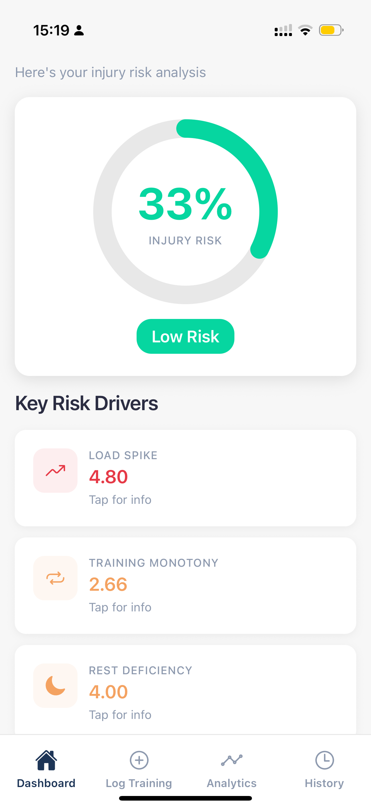
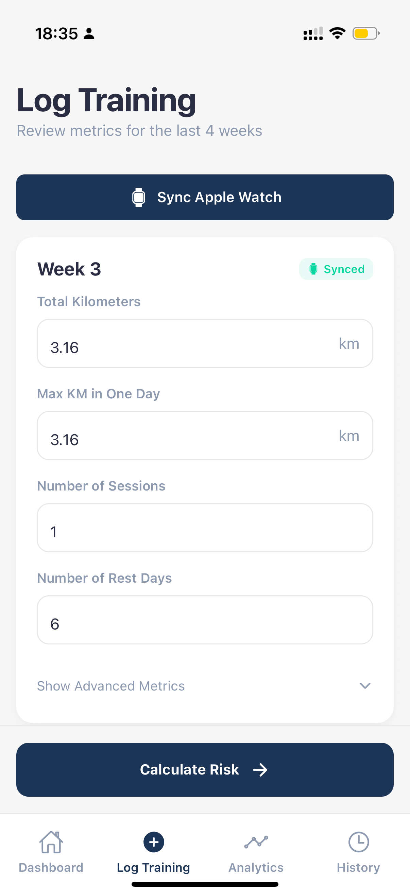
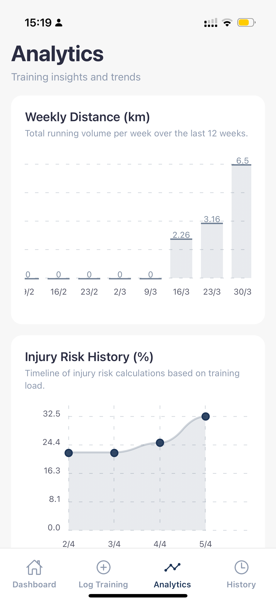
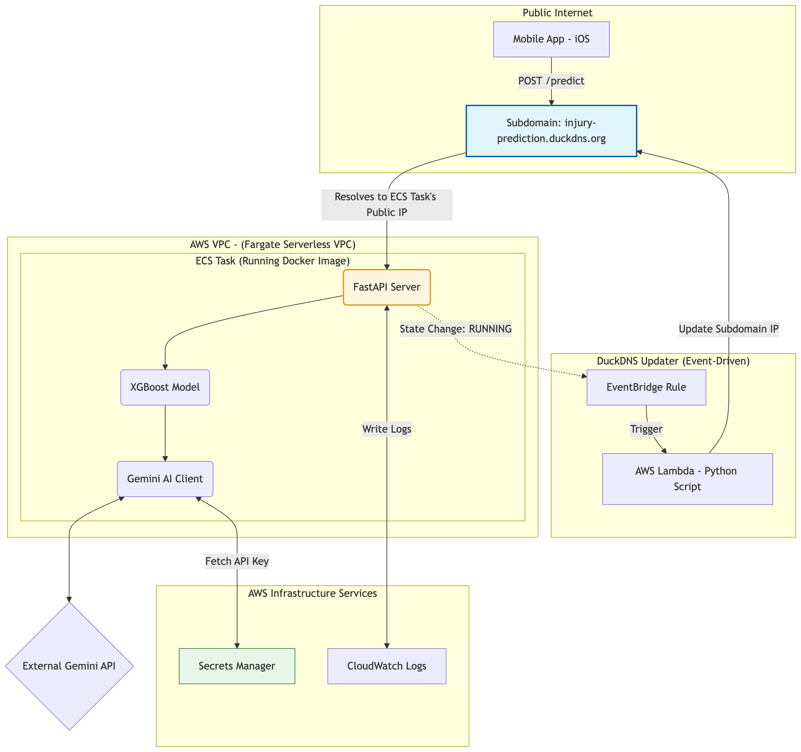

# 🏃‍♂️ Running Injury Prediction


A mobile app that predicts injury risk for runners using machine learning. Built for my BSc Computer Science dissertation.

The system pulls training data from Apple Watch, calculates sports science metrics (ACWR, monotony, recovery gaps), runs it through an XGBoost model trained on 7 years of professional runner data, and gives you a risk score + personalized recommendations.

**Tech:** React Native, FastAPI, XGBoost, AWS (ECS Fargate), Google Gemini

[Live Landing Page](https://d1iit8mbrb3zms.cloudfront.net/)

---

## What It Does

The app answers one question: **"Am I training too hard and about to get injured?"**

It analyzes:
- **Load spikes** (did you suddenly jump from 10km/week to 40km?)
- **Training monotony** (same run every day = overuse risk)
- **Recovery deficits** (not enough rest days)
- **High-intensity exposure** (too much hard running)

Then it returns a **risk percentage** along with actionable recommendations.

---

## App Demo

<p align="center">
  
</p>

---

## Screenshots

| Dashboard | Training Log | Analytics |
|-----------|-------------|-----------|
|  |  |  |

> **Risk Gauge** • **Apple Watch Sync** • **12-week trend charts**

---

## Architecture & Deployment

The backend is deployed on AWS using a containerised setup with ECS Fargate. The system also uses event-driven components to handle dynamic IP updates and secure configuration.



**Key Components:**

- **ECS Fargate:** Runs the backend container without needing to manage servers  
- **EventBridge + Lambda:** Updates the DuckDNS domain when the backend IP changes  
- **Secrets Manager:** Stores API keys securely (no hardcoding)  
- **CloudWatch:** Used for logging and monitoring  

---

**Data Flow:**

1. User syncs 12 weeks of runs from Apple Watch (distance, heart rate, sessions)  
2. App calculates features such as ACWR, monotony, and recovery metrics  
3. Backend performs feature engineering and runs the XGBoost model  
4. Gemini generates personalised recommendations based on the results  
5. Data is stored locally on the device (AsyncStorage) — no backend database  

---

## Project Structure

```text
.
├── mobile-app/          # React Native (Expo)
│   ├── src/
│   │   ├── screens/     # Dashboard, Log Training, Analytics, History
│   │   ├── services/    # HealthKitService.js
│   │   ├── context/     # AppContext (state management)
│   │   └── api/         # apiClient.js
│   └── package.json
│
├── ml_service/          # FastAPI + ML
│   ├── app/
│   │   ├── main.py              # FastAPI endpoints
│   │   ├── core/
│   │   │   └── engineering.py   # Feature engineering
│   │   ├── models/
│   │   │   └── injury_model.pkl # Trained XGBoost model
│   └── requirements.txt
│
└── landing-page/        # Static HTML (S3)
    └── index.html
```
---

## Tech Stack

**Frontend:**
- React Native 0.74 (Expo)
- HealthKit integration (`@kingstinct/react-native-healthkit`)
- AsyncStorage (local persistence)
- React Navigation

**Backend:**
- FastAPI (Python 3.11)
- XGBoost (trained on 42,798 training weeks from 74 athletes)
- Pandas/NumPy for feature engineering
- Google Gemini API for recommendations

**Cloud (AWS):**
- ECS Fargate (containerized backend)
- S3 + CloudFront (landing page hosting)
- Secrets Manager (API keys)
- CloudWatch (logging)

---

## Machine Learning Details

**Model:** XGBoost Classifier  
**Performance:** ROC-AUC 0.752 | PR-AUC 0.126 (expected due to heavy class imbalance)  
**Training Data:** 7-year dataset from Dutch running team (Lövdal et al. 2021)  
**Class Imbalance:** 73:1 (healthy weeks vs injury weeks) - handled with `scale_pos_weight`

**Top 5 Features:**
1. `monotony_weekly_load` - Training consistency
2. `acwr_hi_kms` - High-intensity workload ratio
3. `cv_exertion_7d` - Perceived exertion variability
4. `interval_intensity_zscore` - Unusual hard sessions
5. `acwr_total_kms` - Total volume ratio

**Regularization:** max_depth=2, min_child_weight=80, L1/L2 penalties to prevent overfitting on small dataset.

---

## Local Development

### 1️⃣ Backend
```bash
cd ml_service
pip install -r requirements.txt
uvicorn uvicorn app.main:app --reload --host 0.0.0.0 --port 8000
```

Backend runs at `http://localhost:8000`  
API docs at `http://localhost:8000/docs`

### 2️⃣ Mobile App
```bash
cd frontend
npm install
npx expo start
```

Press `i` for iOS simulator (requires Xcode on Mac)

**Note:** HealthKit only works on physical iOS devices, not simulators.

---

## 🎓 What I Learned

This was my first time:
- Deploying a real ML model to production (not just a Jupyter notebook)
- Integrating HealthKit (which has limited documentation in some areas)
- Handling severe class imbalance (73:1 ratio)

**Proud of:** The feature engineering pipeline. Going from "total km" to "7-day coefficient of variation in perceived exertion" based on actual sports science research (Gabbett 2016, Foster 1998) was satisfying.

---

## Example API Request
```bash
curl -X POST "http://injury-prediction.duckdns.org:8000/predict" \
  -H "Content-Type: application/json" \
  -d '{
    "athlete_id": 1001,
    "training_history": [
      {
        "date": 1711929600000,
        "total_kms": 45.2,
        "nr_sessions": 6,
        "avg_exertion": 6.5,
        "avg_recovery": 7.0,
        ...
      },
      // 11 more weeks
    ]
  }'
```

**Response:**
```json
{
  "injury_risk_percent": 67.4,
  "risk_level": "high",
  "key_factors": {
    "acwr_total_kms": 1.85,
    "monotony_weekly_load": 2.1,
    "rest_day_deficiency_14d": 3.0
  },
  "recommendations": [
    "Reduce weekly volume by 30% for next 2 weeks",
    "Add at least 1 full rest day per week",
    "Focus on low-intensity aerobic base building"
  ]
}
```

---

## Known Limitations

- **No backend database** - all predictions stored locally on device
- **iOS only** - HealthKit doesn't exist on Android
- **AWS costs** - backend may be stopped to save money (it's a student project!)
- **Small training dataset** - 73 athletes isn't huge, so model might not generalize to very different populations
- **Weekly aggregation** - the dataset only has weekly summaries, not daily training logs, which limits granularity

---

## 📚 References

- Lövdal et al. (2021) - *Injury prediction in competitive runners with machine learning*
- Gabbett (2016) - *The training-injury prevention paradox*
- Foster (1998) - *Monitoring training in athletes with reference to overtraining syndrome*

---

## License

This is a university dissertation project (Middlesex University, 2026). Code is available for educational purposes.

---

## 👤 Author

**Ben Salem El Ansari**  
BSc Computer Science - Middlesex University  
🔗 [LinkedIn](https://www.linkedin.com/in/ben-elansari/) 
